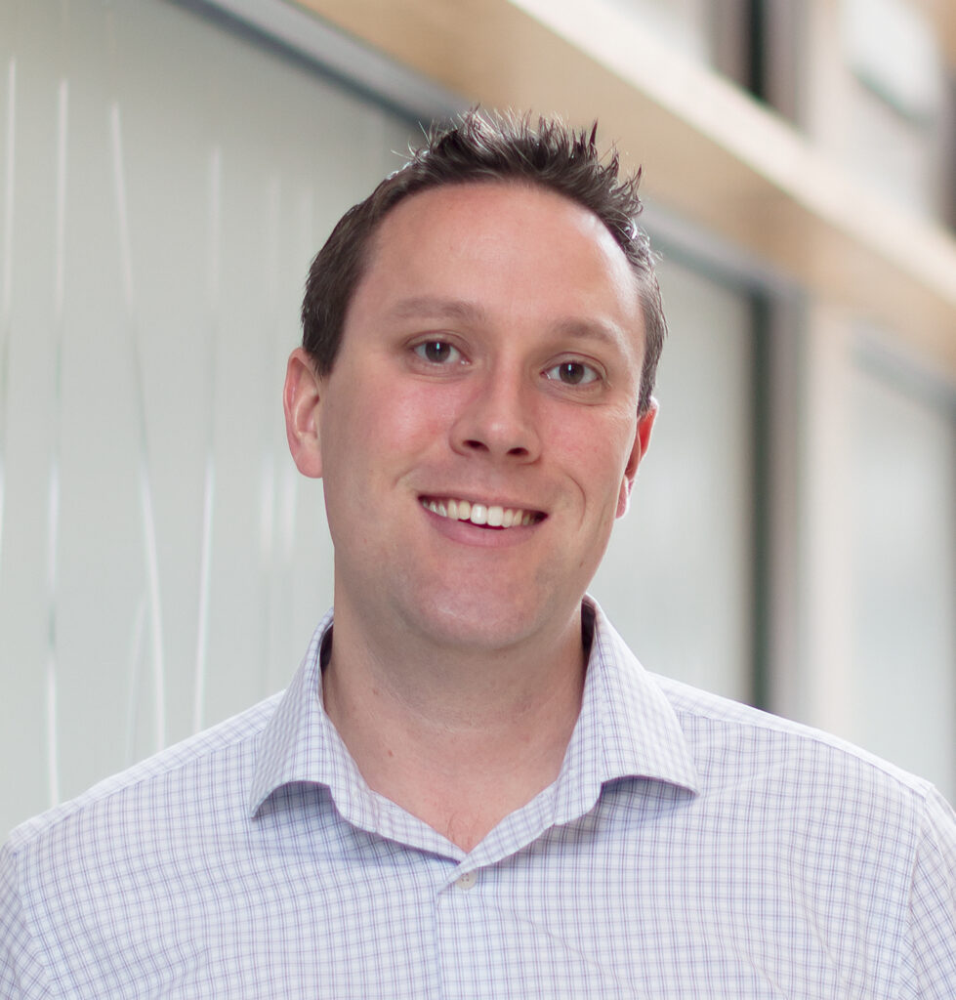
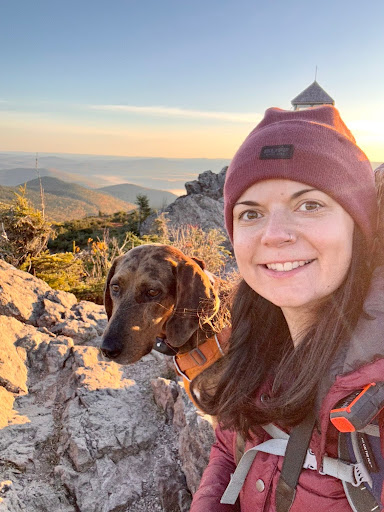
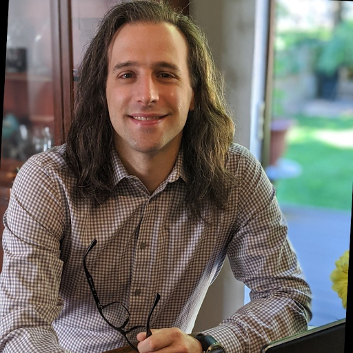
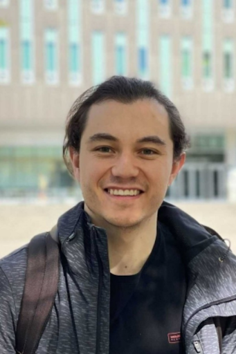
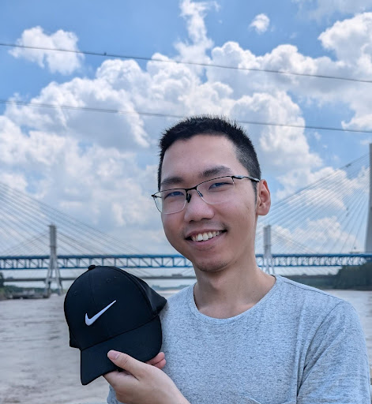
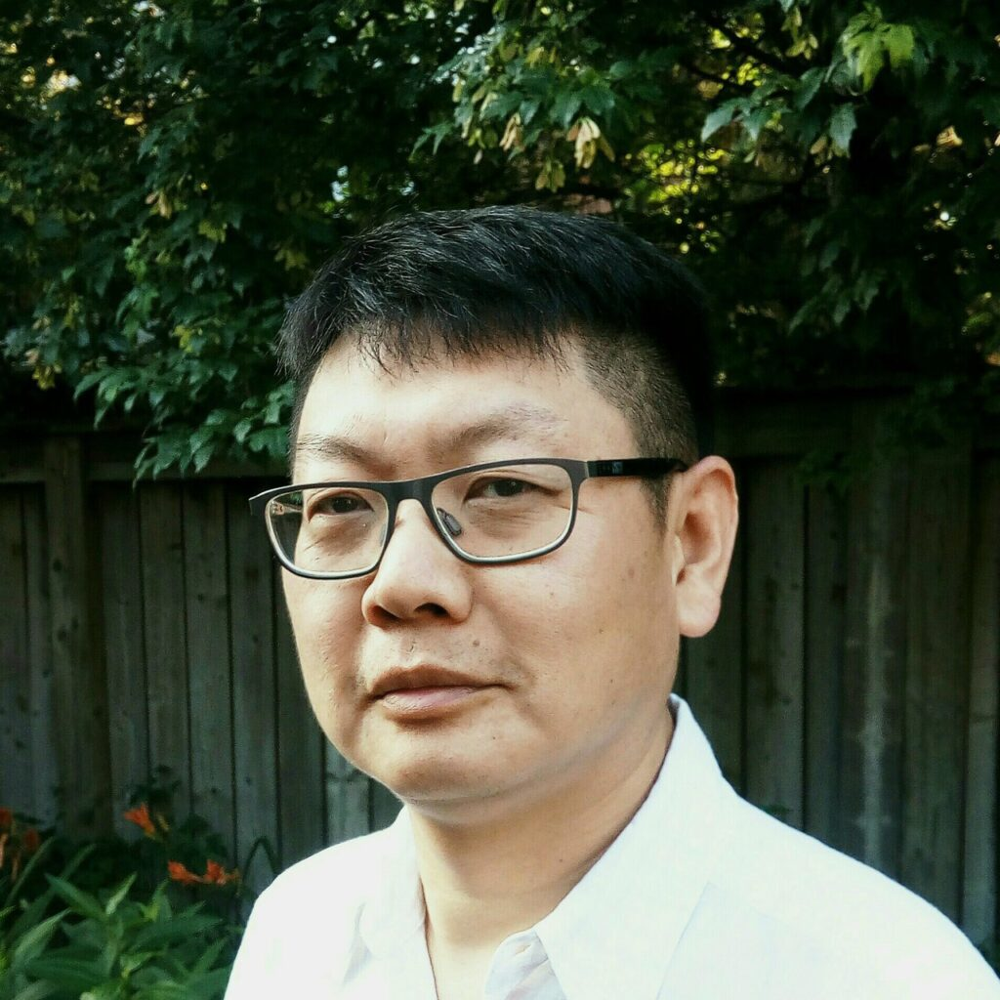

## Meet Your Faculty

### Morgan Langille

>Professor 
Dalhousie University

The focus of Dr. Langille’s research is to better understand human-microbial interactions and how that can be used to improve human health. This includes leveraging novel genomic technologies and developing improved bioinformatic methods to process and integrate multi-omic data to aid in biological interpretation. These discoveries will hopefully lead to novel applications for diagnosis and therapeutics.

### Robyn Wright

>Postdoctoral Fellow 
Dalhousie University

Robyn Wright is a microbial ecologist that completed her BSc in Marine Biology at the University of Plymouth (UK) before earning her PhD in Biological Sciences at the University of Warwick (UK) at the end of 2019. Her background is in marine microbial ecology and she studied the colonization and biodegradation of plastics during her PhD as well as in her first postdoc, where she moved to the School for Resources and Environmental Studies at Dalhousie University in Nova Scotia, Canada. She currently works within the lab of Dr. Morgan Langille, where her research aims to understand the roles that microbial communities play in human and ecosystem health and disease, and to assess and benchmark the methods that we use to study microbial systems. She enjoys working on diverse microbial ecology topics and several of her current research projects study the associations between the oral microbiome and mental and physical health conditions. She is also involved with maintaining and updating computational tools, including PICRUSt2 – a popular tool used for functional prediction within microbial communities – and with developing new tools, for example, for use in verifying the results that we obtain from metagenomic taxonomic classification tools.

### Ryan J. McLaughlin

>Ph.D. Candidate 
University of British Columbia

Ryan is a professional bioinformatician with over 15 years of industry experience. His overarching interest is finding ways to apply cutting-edge genomics technologies in the exploration and characterization of microbial communities. He has special interest in how culture-free methods can be used in concert to better resolve ecosystems at both the population- and community-level. His goal is to leverage data-driven solutions, ranging from proven machine-learning techniques to emerging artificial intelligence models, to unravel the mysteries of biological life on earth and beyond. Ryan specializes in algorithm development, analysis pipeline architecture and cloud resource engineering - all culminating in the full-stack deployment of robust bioinformatics solutions. Ryan has a BS in Biophysics from The University of Scranton, an MSc in Biology (focus in bioinformatics) from Western Washington University, and is currently finishing a PhD in Bioinformatics at The University of British Columbia.

### Juan Santana

>Ph.D. Candidate 
University of British Columbia

Juan Santana holds BSc degrees in Microbiology and Biology from the University of Los Andes (Colombia), where he studied Lysinibacillus sphaericus for mosquito control as both an undergraduate and research microbiologist. He later earned an MSc in Microbiology and Biotechnology from the University of Alberta, investigating microbial communities in reclaimed soils from the Athabasca Oil Sands Region and working on biochar-based land reclamation strategies. Now a PhD candidate in the Hallam Lab at the University of British Columbia, Juan applies integrated multi-omics and statistical approaches to optimize anaerobic digestion systems for renewable natural gas production and waste-to-energy conversion.

### Tony Liu

>Ph.D. Candidate 
University of British Columbia

Tony completed his BSc at the University of British columbia studying Microbiology and Computer Science. Continuing on at the Hallam Lab, he is currently modelling microbial metabolism at different scales of biological organization in the context of mobile genetic elements and cyanobacterial communities. Recognizing the reproducibility crisis in bioinformatics, Tony is developing a workflow automation framework to integrate existing standards for software portability and interoperability. He ultimately aims to create archive-stable computational pipelines for modelling the installation of functional gene modules into genome operating systems.

### Zhibin Lu

>HPC and Bioinformatics Services Manager 
Princess Margaret Cancer Centre, University Health Network

Zhibin Lu is a senior manager at University Health Network Digital. He is responsible for UHN
HPC operations and scientific software. He manages two HPC clusters at UHN, including
system administration, user management, and maintenance of bioinformatics tools for
HPC4health. He is also skilled in Next-Gen sequence data analysis and has developed and
maintained bioinformatics pipelines at the Bioinformatics and HPC Core. He is a member of the
Digital Research Alliance of Canada Bioinformatics National Team and Scheduling National
Team.
